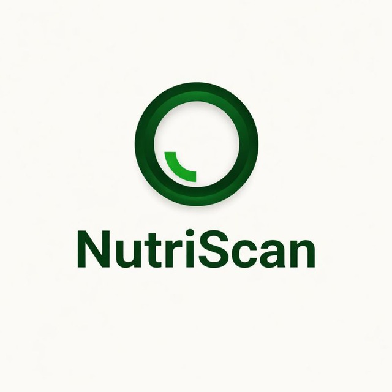

# NutriScan AI

<p align="center">
  
</p>

<p align="center">
  
  
  
  
</p>

<p align="center">
  <a href="https://nutriscan-tan.vercel.app">
    
  </a>
</p>

## 🌐 Live Demo

👉 https://nutriscan-tan.vercel.app

---

## 📖 About NutriScan

NutriScan AI is an AI-powered packaged food analyzer built with Next.js and Google's Gemini AI.

Users can:
- Scan food ingredient lists from images
- Paste ingredients manually
- Get AI-powered health analysis instantly

The app provides:
- Ingredient breakdowns
- Health ratings
- Personalized warnings
- Healthier alternatives
- Interactive ingredient explanations
- Telegram-based feedback system

NutriScan is designed with a modern mobile-friendly UI and works as a Progressive Web App (PWA).

---

## ✨ Features

### 🔍 Multi-Modal Input
Analyze food products by:
- Uploading ingredient images
- Using the camera directly
- Typing ingredients manually

### 🤖 AI-Powered Analysis
Powered by Gemini AI to provide:
- Ingredient health classification
- Personalized warnings
- Overall product health rating
- Suggested healthier alternatives

### 📬 Telegram Feedback Integration
- User feedback sent directly through Telegram Bot API
- Real-time feedback notifications
- Lightweight and simple backend integration

### 📱 PWA Support
- Installable on desktop and mobile
- Fast loading experience
- Offline-ready architecture

### 🎨 Modern UI
Built using:
- ShadCN UI
- Tailwind CSS
- Responsive design system

---

## 🚀 Tech Stack

| Technology | Usage |
|---|---|
| Next.js | Frontend Framework |
| TypeScript | Type Safety |
| Gemini AI | AI Analysis |
| Genkit | AI Workflow Engine |
| Tailwind CSS | Styling |
| ShadCN UI | UI Components |
| Telegram Bot API | Feedback System |
| next-pwa | Progressive Web App |

---

## 📁 Project Structure

```bash
.
├── src
│   ├── app
│   ├── ai
│   ├── components
│   └── lib
├── public
├── docs
├── .env
├── next.config.ts
└── tailwind.config.ts
```

---

## ⚙️ Installation

### 1. Clone Repository

```bash
git clone https://github.com/ayush4151y/nutriscan.git
cd nutriscan
```

### 2. Install Dependencies

```bash
npm install
```

### 3. Setup Environment Variables

Create a `.env` file in the root directory:

```env
GEMINI_API_KEY=YOUR_API_KEY_HERE
TELEGRAM_BOT_TOKEN=YOUR_TELEGRAM_BOT_TOKEN
TELEGRAM_CHAT_ID=YOUR_CHAT_ID
```

Get your Gemini API key from:
https://aistudio.google.com/app/apikey

### 4. Run Development Server

```bash
npm run dev
```

Open:

```txt
http://localhost:9002
```

---

## 🔐 Recommended .gitignore

```gitignore
.env
.next
node_modules
.modified
```

This helps prevent accidental exposure of sensitive files and unnecessary build outputs.

---

## 📱 Install as App (PWA)

### Android
- Open website in Chrome
- Tap `Install App` or `Add to Home Screen`

### Desktop
- Open website in Chrome/Edge
- Click install icon in address bar

---

## 🤖 How AI Works

NutriScan uses Genkit AI flows with Gemini models.

Main workflow:
1. User uploads ingredient data
2. AI extracts and analyzes ingredient information
3. Gemini generates health insights
4. Results are displayed interactively
5. User feedback can be forwarded using Telegram Bot integration

---

## ⚠️ Disclaimer

NutriScan provides AI-generated nutritional insights and should not replace professional medical advice.

Always consult a qualified healthcare professional for dietary or medical concerns.

---

## 🎯 Who Is This For?

- Fitness enthusiasts
- Health-conscious users
- Parents checking packaged foods
- Students learning about nutrition
- Everyday consumers making smarter food choices

---

## 📄 License

This project is shared for educational and portfolio purposes only.

You may view and learn from the source code, but you may not copy, modify, redistribute, or use this project commercially without permission.

See the LICENSE file for more details.

---

## 👨‍💻 Developer

Developed by Ayush.
